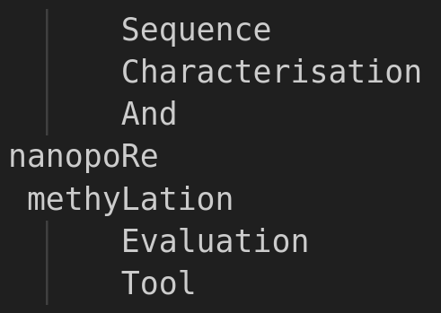

### SCARLET 

<br>

SCARLET provides a [NEXTFLOW](https://www.nextflow.io) version of the [R.O.B.I.N.](https://github.com/looselab/robin) 'live' tumour classification tool.

### Data Input
You need to provide:
1) a sorted BAM file with methylation probabilities that has been aligned to [GRCh38](https://www.ncbi.nlm.nih.gov/datasets/genome/GCF_000001405.26/).
2) the associated .bai index.
3) the GRh38 genome reference sequence.

### Software Requirements:
```
docker
nextflow
```

### Clone repo and download required models
```
git clone https://github.com/graemefox/SCARLET.git
cd SCARLET/bin
wget https://gitlab.com/euskirchen-lab/crossNN/-/blob/master/models/Capper_et_al_NN.pkl
```

### Pull the latest SCARLET docker image:
```
docker pull graefox/scarlet:latest
```

### Pull the latest version of the required wf-human-variation workflow
```
nextflow pull epi2me-labs/wf-human-variation
```

### Example command:
```
## define sample name, ID and output directory, input BAM and reference genome:

SAMPLE=sample_01
PATIENT=JohnDoe
OUTPUT_DIR=${SAMPLE}_output
BAM=my_data.bam
REFERENCE=my_reference.fa.gz
ANNOTATIONS=my_annotation_set.gtf

## run the pipeline
nextflow run graemefox/SCARLET \
        -with-docker graefox/scarlet:latest \
        --sample $SAMPLE \
        --bam $BAM \
        --outdir $OUTDIR \
        --reference $REFERENCE \
        --annotations $ANNOTATIONS \
        --nanoplot \
        --sturgeon --rapidcns2 --nanodx
```

### Optional extra parameters (with their default values)
These a have default values specified in the nextflow.config file, but you may override them on the CLI.
```
--threads 16 (CPUs to use [default: 64]) 
--bam_min_coverage (minimum coverage required to run the epi2melabs/wf-human-variation stages [ default: 5]) 
--minimum_mgmt_cov (minimum avg coverage at the mgmt promoter. Coverage must be greater than this to run the analysis of mgmt methylation)
--sturgeon (the nextflow will ALSO run the sturgeon (https://github.com/marcpaga/sturgeon) classifier if the --sturgeon flag is passed [Defualt behaviour is to NOT run sturgeon])
--nanoplot (nextflow will ALSO run NanoPlot to generate a QC report[ Default behaviour is to NOT run nanoplot])

```

### To run with slurm
Add `-process.executor='slurm'` to your nextflow command, then run as normal. You do not need to submit a script with SBATCH, just run the nextflow command as normal and nextflow knows
to submit each process into SLURM.

### Troubleshooting tips
If the run seems to hang forever at the cnvpytor step, it may be that you have not indexed your input bam. This is also just quite a long process.

If you get the Docker Error: "docker: permission denied while trying to connect to the docker daemon socket".... on Ubuntu (based) systems, you need to add your user to the docker group. 
Follow the instructions here: (https://www.digitalocean.com/community/questions/how-to-fix-docker-got-permission-denied-while-trying-to-connect-to-the-docker-daemon-socket)
