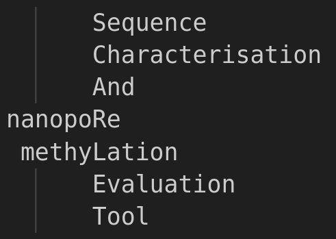

### SCARLET 

<br>

SCARLET provides a [NEXTFLOW](https://www.nextflow.io) version of the [R.O.B.I.N.](https://github.com/looselab/robin) 'live' tumour classification tool.

### Data Input
To generate sequence data suitable for SCARLET analysis, we recommend either runnig the [R.O.B.I.N.](https://github.com/looselab/robin) 'live' tool, or using [Readfish](https://github.com/LooseLab/readfish) with the file of targets at ```bin/NPHD_panel_hg38_clean.bed``` Either of these options will produce a data set suitable for analysis.

You need to provide:
1) a sorted BAM file with methylation probabilities that has been aligned to [GRCh38](https://www.ncbi.nlm.nih.gov/datasets/genome/GCF_000001405.26/).
2) the associated .bai index.
3) the GRh38 genome reference sequence and annotation set (GTF).

### Updates in v0.02
1) updated to work with modkit v0.5 (updated in docker image)
2) second model added to nanoDx/crossNN classifier: pancan
3) CNV results summarised in table in report
4) New output generated: csv file of results
5) Singularity support

### Software Requirements:
```
git
docker / singularity
nextflow
```

### Clone repo and download required models
```
git clone --branch dev --single-branch https://github.com/graemefox/SCARLET.git
wget https://gitlab.com/euskirchen-lab/crossNN/-/raw/master/models/Capper_et_al_NN.pkl?inline=false -O SCARLET/src/Capper_et_al_NN.pkl
wget https://gitlab.com/euskirchen-lab/crossNN/-/raw/master/models/pancan_devel_v5i_NN.pkl?inline=false -O SCARLET/src/pancan_devel_v5i_NN.pkl
```

### Pull the DEV SCARLET docker image:
```
docker pull graefox/scarlet:dev7
```

### Pull the latest version of the required wf-human-variation workflow
```
nextflow pull epi2me-labs/wf-human-variation
```

### Example command:
```
## define sample name, ID and output directory, input BAM and reference genome:

SAMPLE=sample_01
OUTDIR=${SAMPLE}_output
BAM=my_data.bam
REFERENCE=my_reference.fa
ANNOTATIONS=my_annotation_set.gtf

## run the pipeline
nextflow run SCARLET/main.nf \
        -profile standard \ 
        --sample $SAMPLE \
        --bam $BAM \
        --outdir $OUTDIR \
        --reference $REFERENCE \
        --annotations $ANNOTATIONS \
        --nanoplot
```

### Download and analyse demo data
```
git clone https://github.com/LooseLab/ROBIN_test_set_A.git
samtools merge -@16 -o demo_data.merged.sorted.bam ROBIN_test_set_A/test_data_set/*.bam
samtools index -@16 demo_data.merged.sorted.bam

BAM=demo_data.merged.sorted.bam
SAMPLE=demo_data_sample
OUTDIR=${SAMPLE}_output

nextflow run SCARLET/main.nf \
  -profile standard \
  -c SCARLET/nextflow.config \
  --sample $SAMPLE \
  --bam $BAM \
  --outdir $OUTDIR \
  --reference $REFERENCE \
  --annotations $ANNOTATIONS \
  --nanoplot
```

### Optional extra parameters (with their default values)
These a have default values specified in the nextflow.config file, but you may override them on the CLI.
```
"--threads 16" (CPUs to use [default: 64]) 
"--bam_min_coverage 1" (minimum coverage required to run the epi2melabs/wf-human-variation stages [ default: 1]) 
"--minimum_mgmt_cov 5" (minimum avg coverage at the mgmt promoter. Coverage must be greater than this to run the analysis of mgmt methylation [ default: 5])
"--nanoplot" (nextflow will ALSO run NanoPlot to generate a QC report[ Default behaviour is to NOT run nanoplot])
"-profile singularity" to use singularity rather than docker (standard). Suitable for use on HPC systems
```

### Setting up SCARLET to monitor a directory for input BAMS - aka. the magic folder
On Linux systems you can set up a 'watchdog' that will watch for new BAM files being added to a specified location that will then be analysed.
The BAM requirements are identical to those above except a .bai index is not required (it will be automatically generated).
Conda is required on the system (https://www.anaconda.com/docs/getting-started/miniconda/main).

Create the required conda environment
```
conda env create -f SCARLET/auto_analysis/scarlet_auto.yaml
```

Copy the path to the scarlet_auto Python interpreter given by the following command.
```
conda run -n scarlet_auto which python
```

Edit the included SCARLET.service file with paths suitable for your system (nano SCARLET/auto_analysis/SCARLET.service)
```
[Unit]
Description=SCARLET_auto
After=multi-user.target

[Service]
Type=simple
Restart=no   # change to yes to have the service auto start on boot
StandardOutput=journal
ExecStart=/path/to/scarlet_auto/python -u \
          /path/to/SCARLET/auto_analysis/SCARLET_watchdog.py \
          -i /path/to/auto_SCARLET/ \
          -r /path/to/SCARLET/ \
          -t 64 \
          -f /path/to/hg38_ref.fa \
          -a /path/to/Homo_sapiens.GRCh38.gtf
[Install]
WantedBy=multi-user.target
```

Where arguments in 'ExecStart' are the following, respectively
1) path to the Python interprator you copied above
2) path to SCARLET_watchdog.py in the SCARLET directory downloaded from GitHub
3) path to the directory to watch for BAM files aka. location of the magic folder
4) path to the SCARLET directory downloaded from GitHub
5) number of threads to use
6) path to hg38 reference genome fasta file
7) path to hg38 reference annotations GTF file

Copy the SCARLET.service file to systemd, update and start the service.

```
sudo cp SCARLET/auto_analysis/SCARLET.service /etc/systemd/system/
sudo systemctl daemon-reload
sudo systemctl start SCARLET.service 

# you can stop the service with
# sudo systemctl stop SCARLET.service
```

Monitor the service with journalctl and copy (or symlink) a file into the magic folder to start an analysis
```
sudo journalctl -f -u SCARLET.service

# then in another terminal window
cp my_data.bam /path/to/auto_SCARLET/
```

You should see messages in journalctl that a new BAM has been found, indexing has run, and that the various SCARLET processing steps are running.

### To run with slurm
Add `-process.executor='slurm'` to your nextflow command, then run as normal. You do not need to submit a script with SBATCH, just run the nextflow command as normal and nextflow knows
to submit each process into SLURM.

### Troubleshooting tips
If the run seems to hang forever at the cnvpytor step, it may be that you have not indexed your input bam. This is also just quite a long process.

If you get the Docker Error: "docker: permission denied while trying to connect to the docker daemon socket".... on Ubuntu (based) systems, you need to add your user to the docker group. 
Follow the instructions here: (https://www.digitalocean.com/community/questions/how-to-fix-docker-got-permission-denied-while-trying-to-connect-to-the-docker-daemon-socket)

### About
This workflow uses many third-party tools to function and relies on the hard work and expertise of their respective authors. 
This list includes (but may not be limited to...):

[rapidCNS2](https://github.com/areebapatel/Rapid-CNS2)

[wf-human-variation](https://github.com/epi2me-labs/wf-human-variation)

[modkit](https://github.com/nanoporetech/modkit)

[samtools](https://github.com/samtools/samtools)

[NanoPlot](https://github.com/wdecoster/NanoPlot)

[mosdepth](https://github.com/brentp/mosdepth)

[methylartist](https://github.com/adamewing/methylartist)

[clairS-TO](https://github.com/HKU-BAL/ClairS-TO)

[CNVpytor](https://github.com/abyzovlab/CNVpytor)

[VCFtools](https://vcftools.github.io/)

[ANNOVAR](https://annovar.openbioinformatics.org/en/latest/)

[Sturgeon](https://github.com/marcpaga/sturgeon)

[NanoDX](https://gitlab.com/pesk/nanoDx)

### Licence
SCARLET is distributed under a CC BY-NC 4.0 license. See LICENSE for more information. This license does not override any licenses that may be present in the third party tools used by SCARLET.
